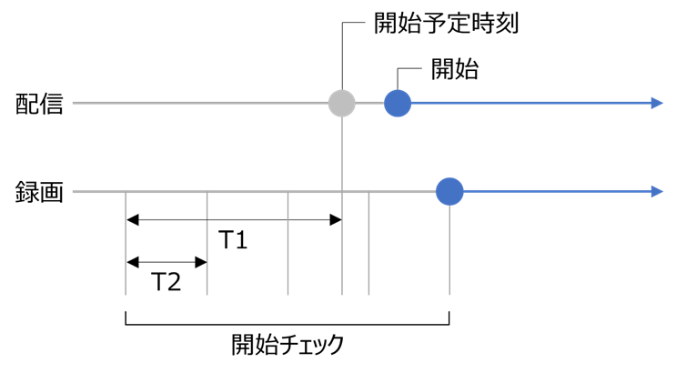

[English](README.md) | [日本語](README.ja.md)

# Unarchived Stream Downloader

YouTube 生配信をダウンロードするツール。

> [!WARNING]
> 本ツールの利用は法律、及びYouTubeの利用規約に抵触する恐れがあります。  
> 本ツールの利用によって生じたいかなる損失や損害についても、当方は一切の責任を負いません。

## 概要

指定されたチャンネルの配信をチェックし、タイトルに指定のキーワードが含まれている場合、  
yt-dlp を使用してその配信をダウンロードします。

## 使い方

1. [yt-dlp](https://github.com/yt-dlp/yt-dlp) 及び [その依存関係](https://github.com/yt-dlp/FFmpeg-Builds) をダウンロードし、同じフォルダに配置します。
2. `appsettings.json` ファイルを設定した後、ツールを実行します。

### `appsettings.json` ファイルの設定

環境に合わせて `appsettings.json` ファイルを設定します。

#### yt-dlp の設定

- `FilePath` - yt-dlp のファイルパスを指定します。
- `Options` - 必要に応じて、yt-dlp の起動オプションを指定します。

```json
"DownloaderSettings": {
  "FilePath": "yt-dlp.exe",
  "Options": [
    "--cookies cookies.txt"
  ]
}
```

#### 動作の設定

- `DownloadAttempts` - ダウンロードの試行回数を指定します。
- `ErrorRetryAttempts` - ダウンロードエラー発生時のリトライ回数を指定します。
- `ErrorRetryIntervalSeconds` - ダウンロードエラー発生時のリトライ間隔(秒)を指定します。
- `StartCheckBufferSeconds` (T1) - 配信開始予定時刻の前に、配信開始チェックを開始する時間(秒)を指定します。
- `StartCheckIntervalSeconds` (T2) - 配信開始をチェックする間隔(秒)を指定します。

```json
"BehaviorSettings": {
  "DownloadAttempts": 10,
  "ErrorRetryAttempts": 3,
  "ErrorRetryIntervalSeconds": 1,
  "StartCheckBufferSeconds": 300,
  "StartCheckIntervalSeconds": 60
}
```



#### 検索の設定

- `ChannelIDs` - ダウンロード対象とするチャンネルのIDを指定します。
- `Keywords` - ダウンロード対象とする配信のタイトルまたは概要欄に含まれるキーワードを指定します。

```json
"SearchSettings": {
  "ChannelIDs": [
    ""
  ],
  "Keywords": [
    "unarchive",
    "no archive"
  ]
}
```

## ライセンス

このソフトウェアは[Unlicense](LICENSE)に基づいてライセンスされています。
