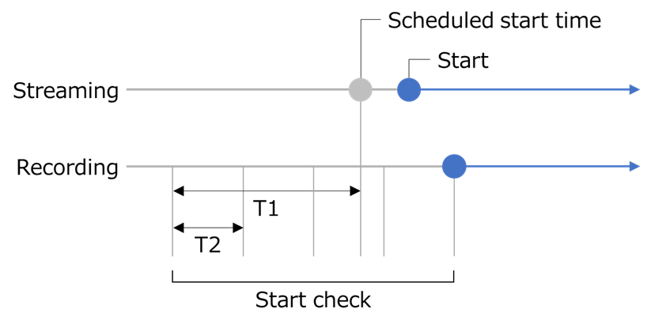

[English](README.md) | [日本語](README.ja.md)

# Unarchived Stream Downloader

A tool for downloading YouTube live streams.

> [!WARNING]
> The use of this tool may violate the law and YouTube's Terms of Service.  
> I will not be held responsible for any losses or damages caused by the use of this tool.

## Overview

Check the specified channel's stream, and if the title contains the specified keyword,  
use yt-dlp to download the stream.

## Usage

1. Download [yt-dlp](https://github.com/yt-dlp/yt-dlp) and [its dependencies](https://github.com/yt-dlp/FFmpeg-Builds), then place them in the same folder.
2. Setting up the `appsettings.json` file, then run the tool.

### Setting Up `appsettings.json` File

Setting up the `appsettings.json` file to match your environment.

#### yt-dlp Settings

- `FilePath` - Set the file path of yt-dlp.
- `Options` - Set the command-line options for yt-dlp, if needed.

```json
"DownloaderSettings": {
  "FilePath": "yt-dlp.exe",
  "Options": [
    "--cookies cookies.txt"
  ]
}
```

#### Behavior Settings

- `DownloadAttempts` - Set the download attempts.
- `ErrorRetryAttempts` - Set the retry attempts when a download error occurs.
- `ErrorRetryIntervalSeconds` - Set the retry interval(in seconds) when a download error occurs.
- `StartCheckBufferSeconds` - Set the buffer time(in seconds) before the scheduled start to check for the start of the stream.
- `StartCheckIntervalSeconds` - Set the polling interval(in seconds) to check for the start of the stream.

```json
"BehaviorSettings": {
  "DownloadAttempts": 10,
  "ErrorRetryAttempts": 3,
  "ErrorRetryIntervalSeconds": 1,
  "StartCheckBufferSeconds": 300,
  "StartCheckIntervalSeconds": 60
}
```



#### Search Settings

- `ChannelIDs` - Set the channel ID(s) to be downloaded.
- `Keywords` - Set the keyword(s) contained in the streaming title to be downloaded.

```json
"SearchSettings": {
  "ChannelIDs": [
    ""
  ],
  "Keywords": [
    "unarchive",
    "no archive"
  ]
}
```

## License

This software is licensed under the [Unlicense](LICENSE).
